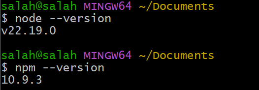

# Manual configurar github por ssh

Para configurar github por ssh, necesitamos tener una cuenta de github e instalar git [Git](https://git-scm.com/)

## Comprobación e Instalación de paquetes

Abrimos la terminal de git (git bash) y verificamos que git esta instalado con el comando $git --version

    

 

Necesitaremos los paquetes npm y node.js para completar nuestra configuración. Para eso, haremos antes una verificación de si están instalados en nuestra máquina con los comandos node --version y npm --version.

    

 

Es recomendable trabajar sobre una carpeta especifica para cada proyecto y no sobre la raíz del sistema.

    

 

## Instalación de la clave en GitHub

Lo primero que vamos a hacer es entrar a nuestro perfil de GitHub, copiamos nuestro nombre de usuario y nos vamos al apartado de ajustes para ver el correo electrónico que tenemos.

Abrimos la terminal de git (git bash), hacemos un $git config --global user.name "nuestro nombre de usuario" y lo mismo con el correo electronico sustituyendo user.name por user.email.

Para eso, en git vamos a comprobar primero el archivo .gitconfig con el siguiente comando.

    

 

En caso de que no tengamos los datos necesarios para la configuración, usamos $git config user.name "(nombre de usuario en github)" y $git config
user.email "(email)" 

    

 

Lo segundo que haremos será crear y preparar el repositorio local. Empezamos creando un archivo.md (markdown) e inicializamos el repositorio

    

 

Despues tendremos que añadir el archivo README.md creado anteriormente a nuestro directorio de trabajo con el comando $git add README.md(Normalmente se suele utilizar '.' para añadir todos los archivos). Luego comentamos los cambios hechos con el comando $git commit -m "comentario".

    

 

Comprobamos con $git status -s si tenemos algun un archivo o carpeta pendiente para subir, en este caso no hay nada.

## Conectar con el repositorio remoto en GitHub

Una vez hecho nuestro commit, vamos a entrar a nuestra cuenta de [GitHub](https://github.com/) y crearemos un repositorio llamado igual que el repositorio local, en este caso "manual_git".

    

 

Desde el local conectaremos con el repositorio remoto en GitHub

    

 

## Verificar la clave

Y por ultimo verificamos que nuestro github está enlazado con git mediante ssh haciendo un $git push origin main (Recordamos que origin es el nombre de la ruta del repositorio remoto en GitHub).

    

 

Es recomendable hacer un pull siempre antes de hacer cualquier cosa. De esta manera nos aseguramos de que no haya una conflicto entre el repositorio remoto (Github) y el repositorio local (Git).

